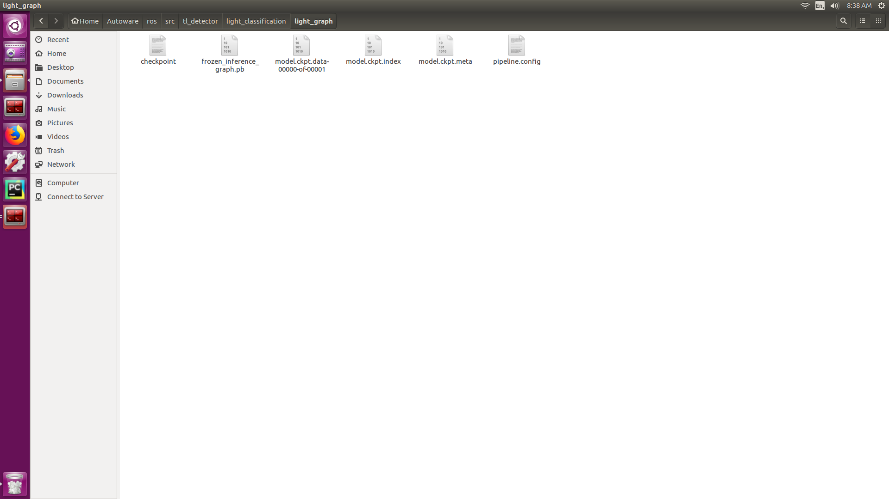

## 检测器
将训练好的检测器的所有文件（即 `frozen_inference_graph.pb` 所在路径下的所有文件）
例：
```
-checkpoint
-frozen_inference_graph.pb
-model.ckpt.data-00000-of-00001
-model.ckpt.index
-model.ckpt.meta
-pipeline.config
```

全部放到 `./tl_detector/light_classification/light_graph/` 中。并将 `./tl_detector` 所有文件夹移动到本地 `/home/up/Autoware/ros/src/`中。
## 其他文件
1. 将 `./styx_msgs/` 移动到 `/home/up/Autoware/ros/src/`
2. 将 `./mindvision/` 移动到 `/home/up/Autoware/ros/src/`
3. 将 `./vehicle_sender.cpp` 覆盖到 `/home/up/Autoware/ros/src/socket/packages/vehicle_socket/nodes/vehicle_sender/`
4. 将 `./launch/` 覆盖到 `/home/up/Autoware/ros/`。
