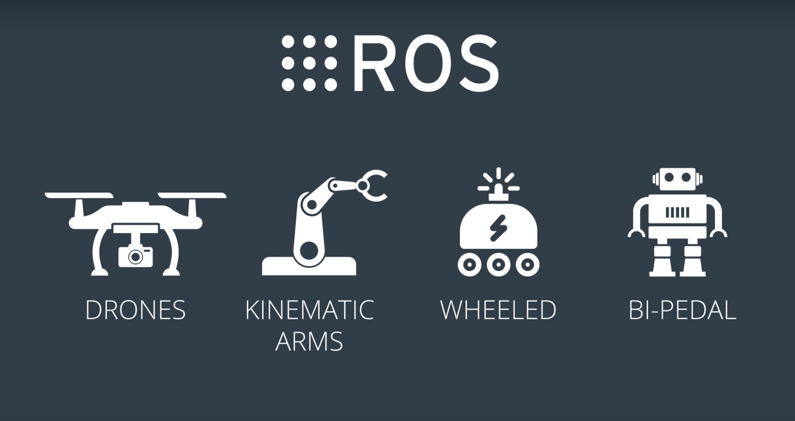
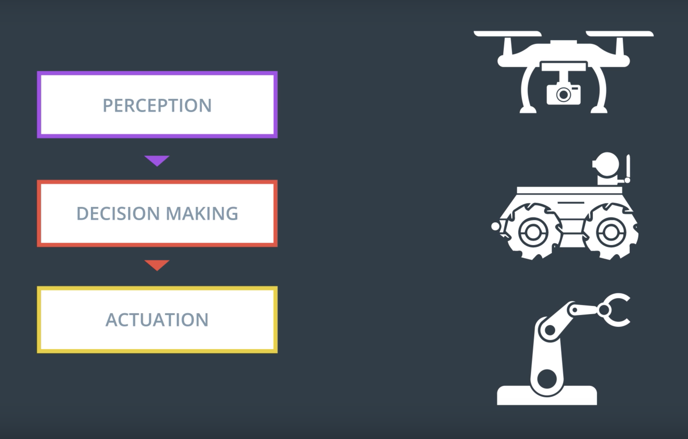
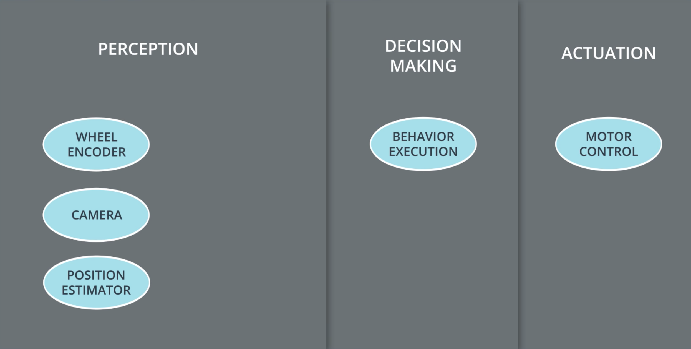
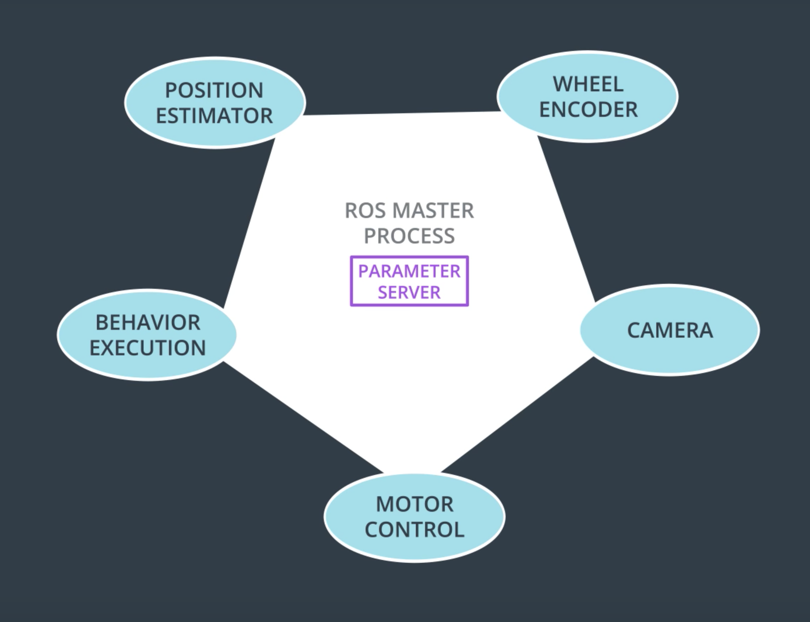
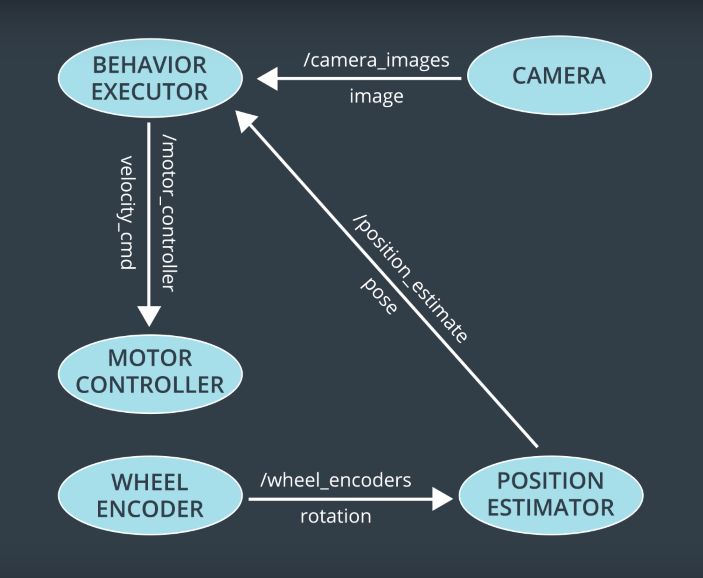
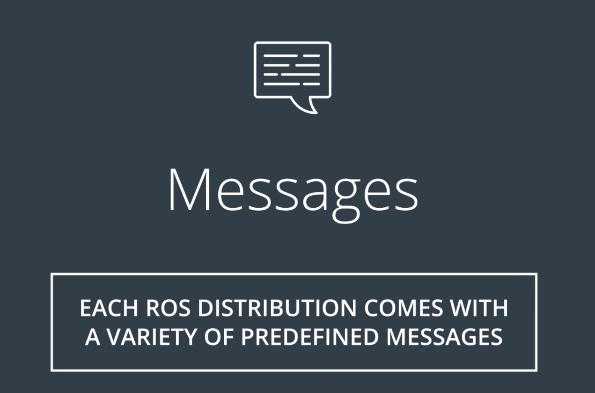
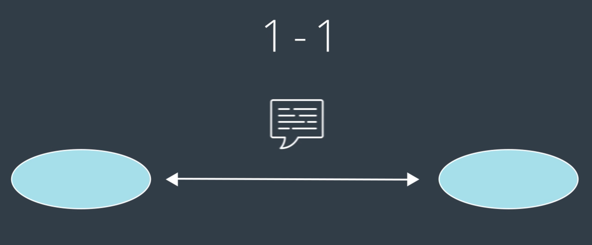
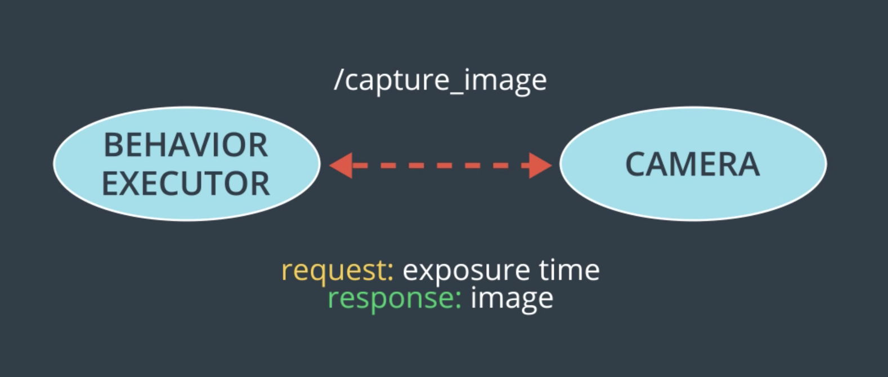

## Robotic Structure
机器人几乎拥有者相同的架构。
ROS 提供了强劲的通信系统，允许不同组件互相沟通。

机器人从构造上来说，都可以执行三个大致步骤：感知、决策与驱动。
## Nodes
ROS 管理这三个复杂的步骤时，将每个分解为很多更小的单元，我们称之为 Nodes。

通常，系统上的每个 Node 负责机器人功能总体的一个特定的小部分。
例如，系统中可能每个传感器都有相应 Nodes
此外还有 Nodes 对应位置估算，行为执行和马达控制。
## Master
在 ROS 有一个主 Node 叫 Master，它相当于所有节点的管理器。

Master 维护着系统上所有 Node 的注册表。它允许每个 Node 发现系统里的其他 Node，并与其建立通信线路。

除了允许 Nodes 相互发现和通信外，Master 还负责作为参数服务器。
如其名称所示，参数服务器通常用于存储参数和配置值，并在运行 Nodes 中共享。
## Topic Publisher/Subscriber
Node 也可以通过在 Topics 相互传递信息实现相互共享数据。
Topics 可以看做 Nodes 之间传递消息的管道。要在一个 Topic 上发送消息，Nodes 必须把消息 Publish 到该 Topic。
同样地，要从一个 Topic 接收消息，Nodes 必须 Subscribe 该主题。

上图说明了我们之前介绍过的 Topicss，Publishers 和 Subscribers。
箭头代表从 Publishers 到 Subscribers 的消息流。
值得注意的是 每个 Node 都可能同时 Publish 并 Subscribe 不同的 Topics。
所以 Node 网络通过 Topics 连接我们称之为 Pub/Sub 架构。
## Messages

Topics 上的 Messages 有许多类型。
预定义的 Message 类型，可直接使用有物理数量通信所需的 Messages 类型，如位置、速度、加速度、旋转和持续时间。还有传感器度数通信所需的 Messages，如激光扫描、图像、点云、惯性测量值等等。

完整的 ROS 安装中可用的 Messages 类型数量实际上非常庞大。
但是，即便有这么多有用的 Messages 类型，有时候我们仍需要自己定义新的类型。

## Services
Publisher 和 Subscriber 之间在 Topic 上传递 Message，非常有用，但这并不是一劳永逸的通信解决方案。

有时候 我们需要 Request/Respond 请求响应模式。对于这种类型的互动，ROS 提供了我们所谓的 Services。

和 Topics 一样 服务允许节点间传递信息。但是 和 Topics 不同，Services 不是并非信息转移，它没有相关联的 Publishers 和 Subscribers。相反 Nodes 通过 Services 互动时，它们是1对1的，并使用 Request/Respond  Message 进行沟通。

我们看看在我们正在开发的例子中 Service 是如何应用的。

假设行为执行器 Node 想要捕捉来自摄像头的一幅图像。摄像头节点定义一个 Service。
Request 信息服务可以是一个定制的 Message 类型，叫曝光时间；Respond 可以是一个图像类型。

向 Service 发起调用 Request 后，执行的 Node 或任何其他类似 Nodes 都能 Request 摄像头根据给定曝光时间捕捉一幅图像。然后，摄像头节点会 Respond  一条包括结果图像的 Message。
